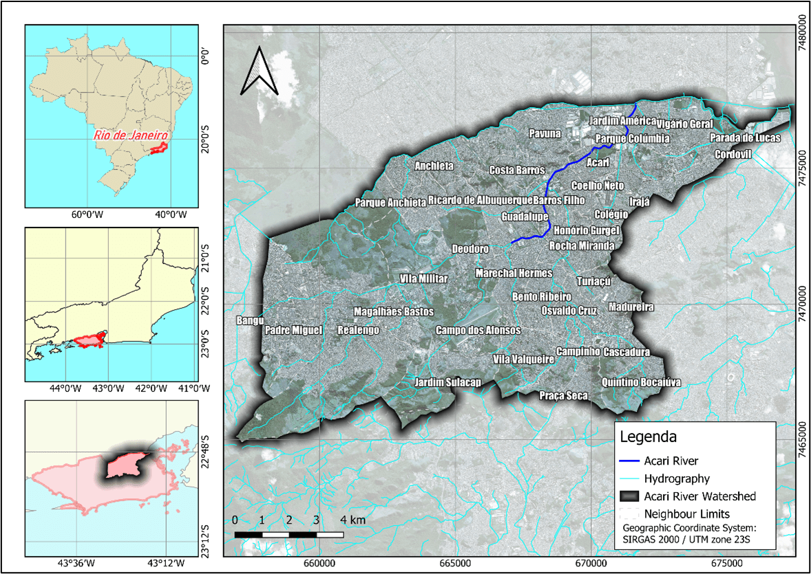

Rio de Janeiro case study
=========================

The Rio de Janeiro case study is being developed as part of the HE-UP2030_ project.
The text below is based on a project blog post which can be found `here <https://up2030-he.eu/2024/12/23/rapid-and-continuous-flood-risk-assessment-and-adaptation-planning-for-rio-de-janeiro/>`_.

Challenge
---------

Floods in urban areas highlight the vulnerability of cities and the complex challenges they face in managing growth and development.
As urbanization accelerates, the impact of floods on densely populated areas becomes more pronounced, with development often pushing into low-lying, flood-prone areas.
Climate change exacerbates these issues through increased precipitation and sea level rise, leading to more severe and frequent flooding.

The Acari River basin (see Figure below) in Rio de Janeiro is a highly populated and flood-prone region, and heavy floods have impacted it in the past.
It is characterized by medium and low-income occupations and several non-planned urban developments.
The area is particularly vulnerable to flooding due to its low-lying position, rapid urbanization, and inadequate drainage systems.
In past floods, such as the significant event in 2010, tens of thousands of people were affected. During the most recent flood in January 2024, 78000 people were affected.
These floods cause widespread damage to homes, infrastructure, and public services, with several neighborhoods in the Acari River basin being submerged.
Damage estimates may range into the hundreds of millions of reais, though exact figures are unknown.
The frequency of such floods has led to ongoing efforts by the city of Rio de Janeiro to improve drainage, build protective infrastructure, and reduce the impact on communities living near the river.
However, challenges such as rapid urbanization and climate-related heavy rains continue to make the region vulnerable.

Application
-----------

Within UP2030, Deltares works together with Rio-Águas, the municipal office for urban drainage, to combat these challenges.
Rio-Águas is responsible for planning, implementing, and maintaining effective drainage systems.
While the city possesses high-quality data, there is currently a lack of flood models to assess and predict flood risks in specific areas.

The area of interest is the Acari River Basin, for which Rio-Águas is in the process of developing a Drainage Masterplan that can guide future drainage interventions, optimize resources, and ensure the city's resilience to flood risks.
The main practical aim of this study was therefore to assist Rio-Águas in developing the Drainage Masterplan.
From the perspective of UP2030, the scientific aim is to investigate the usefulness of global data sets in enhancing local flood risk assessments, considering their advantages and limitations. This will provide insights into how such data can complement local knowledge and decision-making in flood management.

Flood risk assessment
----------------------

The flood risk assessment based on `HydroFlows` is fully reproducible and can be found `in this example notebook <../_examples/rio_risk_climate_strategies.ipynb>`_
The assessment is based on a combination of global data sets and local data.

.. toctree::
   :maxdepth: 1

   ../_examples/rio_risk_climate_strategies.ipynb
