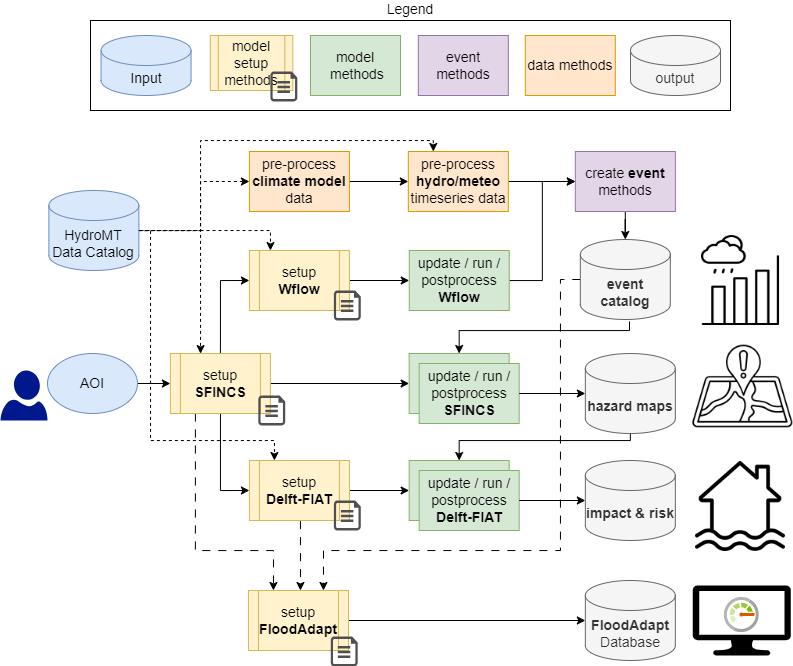

.. _method_library:

Method library
==============

Flood risk workflows
--------------------

An overview of the available methods in HydroFlows is provided in this section.
For more details regarding specifc inputs, outputs, and parameters per ``Method``,
please refer to the method documentation in the :ref:`api_reference` section.

For guidance on combining these methods for flood risk analysis with HydroFlows, see the :ref:`examples` section for typical workflows.

HydroFlows methods can be categorized into three main groups, which are further discussed in subsections:

1. **Data Methods** (orange blocks in Figure) - Handle data retrieval, pre- and postprocessing for various data types.
2. **Event Methods** (blue blocks in Figure) - Generate historical, future, and design events for coastal, rainfall, and discharge data to be used as input for the hazard model.
3. **Model-Related Methods** (yellow and green blocks in Figure) - Building (model setup methods; yellow blocks), updating, running, and postprocessing (model methods; green blocks) of the supported models (i.e., SFINCS, Wflow, Delft-FIAT, FloodAdapt).

.. toctree::
   :maxdepth: 2

   data_methods
   event_methods
   model_methods
