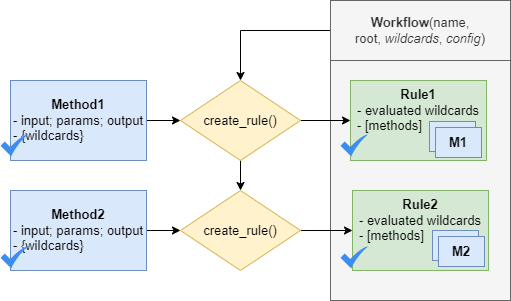

.. _compose_workflow:

Compose a workflow
==================

A workflow is composed by linking methods together using the output files of one method
as input for another method. To compose a workflow, the following steps are taken:

1. initialize a :term:`workflow` with optional :term:`wildcards` and :term:`configuration`.
2. create a :term:`rule` by adding a :term:`method` to the workflow.

Initialize a workflow
---------------------

To initialize the :class:`~hydroflows.workflow.Workflow` class, a user can supply following arguments (all optional):

- The **root directory** *(recommended!)* is the directory where the workflow is executed.
  All input and output files of the rule are relative to this directory.
- The **workflow configuration** is used to store all workflow parameters and input files which are not output of a rule.
  Users can add their own parameters to the configuration and use these to initialize the methods.
  The configuration will also be stored as a separate file in the root directory when parsing the workflow to a workflow engine, see :ref:`parse_to_engine`.
- The **wildcards** are used to evaluate the method wildcards, see :term:`wildcards`.

.. ipython:: python

    from hydroflows.workflow import Workflow
    import logging

    # setup logging
    logging.basicConfig(level=logging.INFO, format='%(levelname)s:%(message)s')

    # initialize a workflow
    wf = Workflow(
        root="./my_workflow",
        config={"model_exe": "bin/model/model.exe"},
        wildcards={"region": ["region1", "region2"]},
    )

    # we now have a workflow with wildcards, but without rules
    print(wf)

Create workflow rules (basic)
-----------------------------

To create a rule, the method it is based on should be initialized first.
A rule is then created by added it to the workflow using the :meth:`~hydroflows.workflow.Workflow.create_rule`.
When calling ``create_rule`` with a method the following steps are executed in the background:

- The :term:`wildcards` are detected and validated. Based on the wildcard values different *method instances* are created.
  This makes it possible to execute the method for multiple input files or parameters in parallel.
  A `ReduceMethod` expects a wildcard on the input files which is not present on the output files.
  An `ExpandMethod` expects a wildcard on the output files which is not present on the input files.
  And a `Method` expects either no wildcards or the same *repeat* wildcard on the input and output files.
- The method input files are either linked to output files of previous rules or set in the workflow configuration.
- A check is performed to ensure the output files are unique (not already used in the workflow).
- The dependencies of the rule are evaluated.
- The rule is added to the workflow.

.. Note::
    You cannot overwrite rules in the workflow or create rules with the same outputs.
    If you want to modify a rule when creating the workflow in an interactive environment,
    you should rerun the workflow creation from scratch. Most IPython Notebooks IDEs have A
    "Run all above" button to rerun the notebook from the beginning.

The following example shows how to create a rule based on a method.
Here, the `model_exe` parameter is set using a reference to the workflow configuration.

.. ipython:: python

    from hydroflows.methods.dummy import RunDummyEvent

    # initialize a dummy method which performs a simulation for an event
    simulate_event = RunDummyEvent(
        event_csv="events/event_x.csv",
        settings_toml="settings.toml",
        model_exe=wf.get_ref("$config.model_exe"),  # use a reference to the workflow configuration
        output_dir="model",
        event_name="event_x",
    )
    print(simulate_event) # inspect the method

    # create a rule and add it to the workflow
    wf.create_rule(simulate_event, rule_id="simulate_event")

    # we now have a workflow with one rule
    print(wf)

The **output files of the method** can be used as **input for subsequent methods**, see example below.
Note that the rules need to be created and added to the workflow in the right order to ensure that the
output files of one method are available as input for the next method.

The following example shows how to create a rule that uses the output of the previous rule.
The output of the previous rule is accessed using the `output` attribute of the method.
A reference to the output file can automatically be created because output files have to be unique in the workflow.

.. ipython:: python

    from hydroflows.methods.dummy import PostprocessDummyEvent

    # initialize a method that postprocesses the output of the simulation
    postprocess = PostprocessDummyEvent(
        model_nc=simulate_event.output.model_out_nc,
        output_dir="results",
        event_name="event_x",
    )
    print(postprocess) # inspect the method

    # add the method to the workflow
    wf.create_rule(postprocess, rule_id="postprocess_event")

    # we now have a workflow with two rules
    print(wf)

Create workflow rules (repeat wildcards)
----------------------------------------

The same workflow can be repeated using :term:`wildcards` in the method input files or parameters.
We use wildcards instead of python loops to ensure that the workflow can be parallelized and executed on a workflow engine.
This is done using the wildcard name between ``{}`` in the input files or parameters of the method.
Note that the wildcard should be on the input and output to repeat the method for each wildcard value.

The following example shows how to create a workflow with repeat wildcards.
First the wildcards are set at the workflow level, then the wildcards are used in the input files and parameters of the method which should be repeated.
Multiple wildcards can be combined in which case the method is repeated for all combinations of the wildcard values.
If the wildcard is accidentally only used in the input files or output files, an error will be raised.

The following example shows how create a rules with repeat wildcards.
The same methods as before are used, but now with the ``{event}`` and ``{region}`` wildcards.
The new rules will have six instances, one for each combination of the wildcards.

.. ipython:: python

    # set the wildcards for the workflow
    wf.wildcards.set("event", ["event01", "event02", "event03"])

    # initialize a method with `region` and `event` wildcards
    simulate_event_repeat = RunDummyEvent(
        event_csv="events/{region}/{event}.csv",
        settings_toml="{region}/settings.toml",
        model_exe=wf.get_ref("$config.model_exe"),  # use a reference to the workflow configuration
        output_dir="model/{region}",
        event_name="{event}",
    )
    print(simulate_event_repeat) # inspect the method

    # add the method to the workflow. Note that we give it a new unique rule_id
    wf.create_rule(simulate_event_repeat, rule_id="simulate_event_repeat")

    # initialize a method that postprocesses the output of the simulation
    postprocess_repeat = PostprocessDummyEvent(
        model_nc=simulate_event_repeat.output.model_out_nc,
        output_dir="results/{region}",
        event_name="{event}",
    )
    print(postprocess_repeat) # inspect the method

    # add the method to the workflow
    wf.create_rule(postprocess_repeat, rule_id="postprocess_repeat")

    # we now have a workflow with four rules, the two new rules are repeated for each event
    print(wf)

Create workflow rules (expand and reduce wildcards)
---------------------------------------------------

In order to create multiple output files from a single set of input files (expand) or to create a single output file from multiple input files (reduce),
special methods called ``ExpandMethod`` and ``ReduceMethod`` can be used, see :ref:`expand_reduce_methods`.

For example, the :class:`~hydroflows.methods.dummy.PrepareDummyEvents` method can be used to create multiple events for different return periods from a single time series.
The method has a ``wildcard`` parameter to define the wildcard name, while its values will be based on the ``rps`` parameter.
Which input parameter is used for expanding or reducing depends on the method logic and is described in the method documentation.
At initialization, an ``ExpandMethod`` stores the name and values as *expand* wildcard which are used to create multiple output files.

.. ipython:: python

    from hydroflows.methods.dummy import PrepareDummyEvents

    # initialize new workflow
    wf = Workflow(
        root="./my_workflow",
        config={"model_exe": "bin/model/model.exe"},
    )

    # initialize a method
    prepare_events = PrepareDummyEvents(
        timeseries_csv="data/timeseries.csv",
        output_dir="events",
        rps=[1,5,10,50,100],
        wildcard="event",
    )
    print(prepare_events) # inspect the method

    # add the method to the workflow
    wf.create_rule(prepare_events, rule_id="prepare_events")

    # inspect the workflow to see if the expand wildcard is set
    print(wf)

After an ``ExpandMethod`` is added to the workflow, the wildcard can be used in subsequent rules to repeat the
method for each value of the wildcard value and/or to reduce over multiple input files.

In the following example, the :class:`~hydroflows.methods.dummy.RunDummyEvent` method is repeated for each event,
created by the :class:`~hydroflows.methods.dummy.PrepareDummyEvents` method,
followed by the ``ReduceMethod`` :class:`~hydroflows.methods.dummy.CombineDummyEvents` that combines the results.
The latter takes the output of all event simulations as input.

.. ipython:: python

    from hydroflows.methods.dummy import CombineDummyEvents

    # initialize a method that simulates the events
    simulate_events = RunDummyEvent(
        event_csv=prepare_events.output.event_csv,
        settings_toml="settings.toml",
        model_exe=wf.get_ref("$config.model_exe"),  # use a reference to the workflow configuration
        output_dir="model",
        event_name="{event}",
    )
    print(simulate_events) # inspect the method

    # add the method to the workflow
    wf.create_rule(simulate_events, rule_id="simulate_events")

    # initialize a method that combines the results of the events
    combine_events = CombineDummyEvents(
        model_out_ncs=simulate_events.output.model_out_nc,
        output_dir="results",
    )
    print(combine_events) # inspect the method

    # add the method to the workflow
    wf.create_rule(combine_events, rule_id="combine_events")

    # we now have a workflow with thee rules, only the second rule is repeated for each event
    print(wf)

More workflow examples
----------------------

More (complex) examples with full flood risk workflows are available in the HydroFlows :ref:`examples`.
