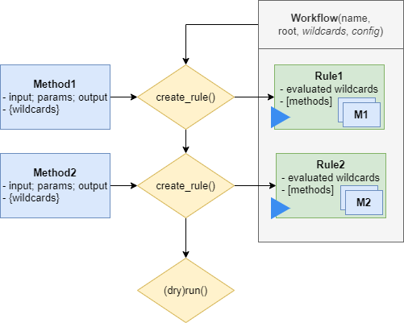

.. _execute_workflow:

==================
Execute a Workflow
==================

After creating a workflow, see :ref:`compose_workflow`, you can execute it using the HydroFlows framework or export it to a workflow engine to execute it.
HydroFlows has a simple implementation which is most suitable for testing parts of your workflow or running simple workflows.
For most workflows, we recommend exporting the workflow to a workflow engine which has more extended capabilities for parallelization, job caching, etc.
Currently, HydroFlows supports exporting workflows to the `SnakeMake`_ workflow engine and the `Common Workflow Language (CWL) <CWL>_`, but other workflow engines can be added in the future.
We don't aim to support all features of the workflow engines but rather provide a simple way to export functioning workflows to these engines. We recommend using the HydroFlows framework to *create*, *validate*, *edit*, and *configure* the workflow and use the workflow engine only to *execute* the workflow.
Below we describe how to execute a workflow in HydroFlows, and with both supported workflow engines.

Execute with HydroFlows
=======================

HydroFlows provides a simple implementation to **run** or **dryrun** a workflow, by running all rules of the workflow in sequence, as shown in the figure below.

The :meth:`~hydroflows.workflow.Workflow.dryrun` method tests if all input files exist and methods in- and outputs are linked correctly. In the example below, a simple workflow is created and the dryrun method called. Note that you need to instantiate a logger to get feedback. You can define the level of verbosity by setting the log level, at minimal a warning level is required to see if files are missing.

.. ipython:: python

    # import Python modules
    import logging
    import tempfile
    from pathlib import Path

    # import the necessary HydroFlows classes
    from hydroflows.methods.dummy import (
        CombineDummyEvents,
        PrepareDummyEvents,
        RunDummyEvent,
    )
    from hydroflows.workflow import Workflow

    # set the log level and format
    logging.basicConfig(level=logging.INFO, format='%(levelname)s:%(message)s')

    # initialize a workflow with input files in the configuration
    input_files = {
        "model_exe": "bin/model/model.exe",
        "model_settings": "model/settings.toml",
        "timeseries_csv": "data/timeseries.csv",
    }
    wf = Workflow(root=tempfile.mkdtemp(), config=input_files)

    # rule 1
    prepare_events = PrepareDummyEvents(
        timeseries_csv=wf.get_ref("$config.timeseries_csv"),
        output_dir="events",
        rps=[1, 10, 100],
        wildcard="event",
    )
    wf.create_rule(prepare_events, rule_id="prepare_events")

    # rule 2
    simulate_events = RunDummyEvent(
        event_csv=prepare_events.output.event_csv,
        settings_toml=wf.get_ref("$config.model_settings"),
        model_exe=wf.get_ref("$config.model_exe"),
        output_dir="model",
        event_name="{event}",
    )
    wf.create_rule(simulate_events, rule_id="simulate_events")

    # rule 3
    combine_events = CombineDummyEvents(
        model_out_ncs=simulate_events.output.model_out_nc,
        output_dir="results",
    )
    wf.create_rule(combine_events, rule_id="combine_events")

    # inspect the workflow
    print(wf)

    # dryrun the workflow, note the missing file warnings
    wf.dryrun()

    # create missing input files
    for filename in input_files.values():
        file = Path(wf.root, filename)
        file.parent.mkdir(parents=True, exist_ok=True)
        file.touch()

    # repeat the dryrun
    wf.dryrun()

The workflow is executed by calling the :meth:`~hydroflows.workflow.Workflow.run` method.
Different instances of methods under one rule (i.e., for repeat :term:`wildcards`) can be run in parallel using the `max_workers` argument.

.. ipython:: python

    # run the workflow
    wf.run(max_workers=2)

.. _parse_to_engine:

Export to and execute with Workflow Engine
==========================================

Exporting a workflow to a workflow engine provides more extended capabilities for parallelization, scalability, and job caching. Compared to running the workflow with HydroFlows, the workflow engine calls methods via the HydroFlows command line interface (CLI) (see :ref:`cli`) outside of the Python kernel, see figure below.

.. figure:: ../../_static/hydroflows_framework_snake.png
    :alt: Parse to SnakeMake and execute
    :align: center

Export to SnakeMake
-------------------

The :meth:`~hydroflows.workflow.Workflow.to_snakemake` method converts the workflow to a SnakeMake file. The SnakeMake file is by default saved as ``Snakefile`` in the root directory of the workflow. The method also creates a configuration file in the root directory with the same name as the SnakeMake file but with the extension ``.config.yml``. The configuration file contains the input files and parameters of the workflow and is referenced in the SnakeMake file.

.. ipython:: python

    # convert the workflow to a snakemake file
    wf.to_snakemake()

    # "Snakefile" and "Snakefile.config.yml" should be in the root directory
    print([f.name for f in wf.root.glob("*") if f.is_file()])

Execute with SnakeMake
^^^^^^^^^^^^^^^^^^^^^^

.. NOTE::
    The SnakeMake library is required to use the SnakeMake CLI and is not included in the default HydroFlows dependencies. To install SnakeMake, we refer to the `SnakeMake installation guide <https://snakemake.readthedocs.io/en/stable/getting_started/installation.html>`_.

The SnakeMake file can be executed using the SnakeMake command line interface (CLI). Below we show two of the most common commands to visualize, dry-run, and run the workflow. The full documentation of the CLI can be found `here <https://snakemake.readthedocs.io/en/stable/executing/cli.html>`_.

Snakemake creates a DAG of the workflow which can be visualized using the ``snakemake --dag`` command, as shown below.

.. code-block:: shell

    $ snakemake --dag Snakefile | dot -Tsvg > dag.svg

The SnakeMake file can be executed using the ``snakemake`` command together with the number of cores to use, as shown below. Snakemake *profiles* can be used to specify the number of cores, memory, SLURM HPC settings, etc., which needs to be specified outside of the HydroFlows framework.

.. code-block:: shell

    $ snakemake -s Snakefile --cores 2

Limitations
^^^^^^^^^^^

Currently, the HydroFlows framework does not support all features of the SnakeMake workflow engine. For example, the following features are not supported:

- **Rule settings**: Specifying the number of **threads**, **resources** (e.g., memory, time), **priority** at the rule level is not yet supported.
- **Directories as output**: Currently, only files can be used as output, not directories.
- **Protected and temporary files**: The ``protected`` and ``temp`` flags are not yet supported.
- **Code tracking**: We use the `shell` directive to run the methods using the HydroFlows CLI, which does not track the code.

Export to CWL
-------------

.. NOTE::
    The Common Workflow Language (CWL) support is under development and will soon be available in HydroFlows.

.. _cli:

Command-line Interface
----------------------

The command line interface (CLI) is meant to provide a generic interface to run methods within the HydroFlows framework.
Almost any workflow engine supports CLI commands which makes it possible to run the workflows from external workflows engines.
Note that users typically do not need to use the CLI directly, but rather use the Python API to create and export workflows which contain the CLI commands.

The CLI is available as the `hydroflows` command after installation of the HydroFlows package.
The main subcommand is `method` which serves as a generic CLI to any Hydroflows `Method` subclass.
The `method` subcommand first validates the parameters by initializing the method ``Method(**kwargs)`` and then calls the ``run()`` method to execute the method.
You can find the syntax of the subcommand using the `--help` flag:

.. code-block:: shell

    $ hydroflows method --help

.. program-output:: hydroflows method --help
