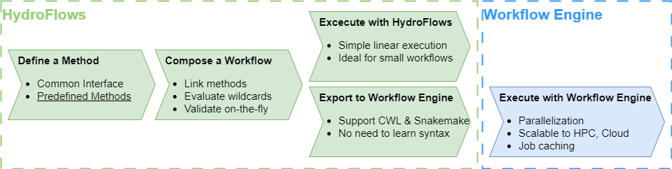

.. _workflow_framework:

Creating workflows
==================

HydroFlows provides a framework that allows users to define methods,
compose and validate workflows using these methods, and execute the workflow.
The execution can be done using the HydroFlows engine, ideal for small workflows
or exported to SnakeMake or CWL to make use of features like parallelization, scalability, and job caching.

Each of these steps in shown in the diagram below and discussed in the following subsections.:

.. toctree::
   :maxdepth: 2

   terminology
   define_method
   compose_workflow
   execute_workflow
   parse_to_engine
   add_own_method
